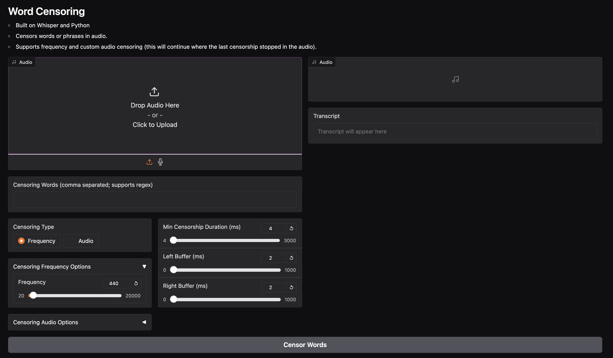

# Word Censoring

- Built on Whisper and Python
- Censors words or phrases in audio.
- Supports frequency and custom audio censoring (this will continue where the last censorship stopped in the audio).

